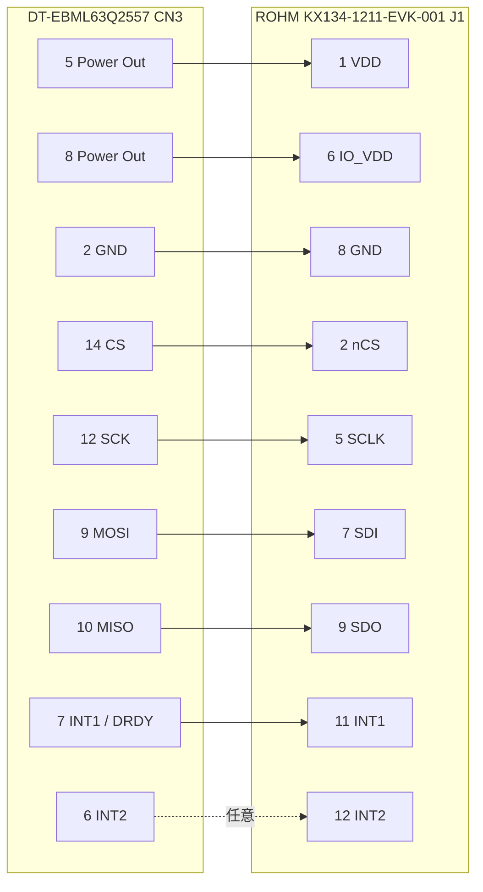

# KX134-1211-EVK-001 変換配線

対象は、DT-EBML63Q2557 のデジタルセンサーコネクタ `CN3` と、
ROHM `KX134-1211-EVK-001` の2×7ピンコネクタ `J1` です。

両方とも14ピンですが、ピンごとの信号配置は異なります。
**ストレートの14ピンリボンケーブルでは接続しないでください。**

## 安全上の注意

- USBケーブルとセンサーを外した状態で変換ケーブルを作る。
- DT-EBML63Q2557 の `JP1` は必ず **3.3 V** に設定する。
- DT-EBML63Q2557 のデジタル入力最大定格は3.6 Vであり、5 V信号を接続しない。
- 基板上の三角印、角パッドまたはシルク表示で1番ピンを確認する。
- 電源投入前に、VDD、IO_VDD、GNDおよび短絡の有無をテスターで確認する。
- 本書の左右表示ではなく、必ず**ピン番号**を基準に配線する。

## コネクタ比較

ピン番号を正面から確認した概念図です。実物の向きはコネクタおよびケーブルの
キー方向によって変わるため、1番ピン表示を優先します。

```text
DT-EBML63Q2557 CN3                 ROHM KX134-1211-EVK-001 J1

  1 SCL       2 GND                  1 VDD       2 nCS
  3 SDA       4 GND                  3 NC        4 NC
  5 POWER     6 INT2                 5 SCLK      6 IO_VDD
  7 INT1      8 POWER                7 SDI       8 GND
  9 MOSI     10 MISO                 9 SDO      10 TRIG
 11 GND      12 SCK                 11 INT1     12 INT2
 13 GND      14 CS                  13 NC       14 NC
```

## SPI変換配線



| DT CN3 | 信号 | ROHM J1 | 信号 | 必須 |
|---:|---|---:|---|:---:|
| 5 | Power Out (3.3 V) | 1 | VDD | Yes |
| 8 | Power Out (3.3 V) | 6 | IO_VDD | Yes |
| 2 | GND | 8 | GND | Yes |
| 14 | CS | 2 | nCS | Yes |
| 12 | SCK | 5 | SCLK/SCL | Yes |
| 9 | MOSI | 7 | SDI/SDA | Yes |
| 10 | MISO | 9 | SDO/ADDR | Yes |
| 7 | INT1 | 11 | INT1 | DRDY使用時 |
| 6 | INT2 | 12 | INT2 | 任意 |

CN3の4、11、13番はすべてGNDです。必要に応じて追加のGND線として利用できます。
J1の10番 `TRIG` は評価基板上でプルダウンされるため、外部トリガを使わない場合は
未接続にします。J1の3、4、13、14番も接続しません。CN3の1番 `SCL` と3番 `SDA` は
SPI動作では使用しません。

## 電源投入前チェック

1. `JP1` が3.3 V側であることを確認する。
2. センサーを外した状態で、CN3側Power Outが3.3 Vであることを測る。
3. 電源を切り、J1-1とJ1-6がPower Outへ、J1-8がGNDへ導通することを確認する。
4. VDD/IO_VDDとGNDが短絡していないことを確認する。
5. 最初は電流制限可能な電源またはUSB電流計を使う。
6. 診断ファームウェアで `WHO_AM_I` が `0x46` になることを確認する。

## 根拠資料

- [DT-EBML63Q2557 ハードウェアユーザーズマニュアル](https://www.datatecno.co.jp/datatecno_core/content/uploads/2025/06/DT-EBML63Q2557_hardware_users_manual_Rev.20250527.pdf)
  - 5.11 デジタルセンサーインターフェース
  - 6.2 デジタルセンサー入力信号の最大定格3.6 V
  - 7.1 CN3ピンアサイン
- [KX134-1211-EVK-001 使い方資料](https://fscdn.rohm.com/kionix/jp/document/kx134-1211-evk-001_ug-j.pdf)
- [ROHM EVK Hardware User's Guide](https://fscdn.rohm.com/jp/products/databook/applinote/ic/sensor/rohm-evk-hw_ug-j.pdf)
- [ROHM 14ピンJ1の信号配置資料](https://fscdn.rohm.com/en/products/databook/applinote/ic/sensor/kx134acr-evk-001_ug-e.pdf)

KX134-1211-EVK-001の資料ではJ1の全ピン表が明記されていない版があるため、
ROHM EVK共通の14ピン物理配線および現行KX134ACR評価基板のJ1配置も照合しています。
購入品が到着したら、基板リビジョン、1番ピン表示、VDD/GNDの導通を実物で再確認してください。
